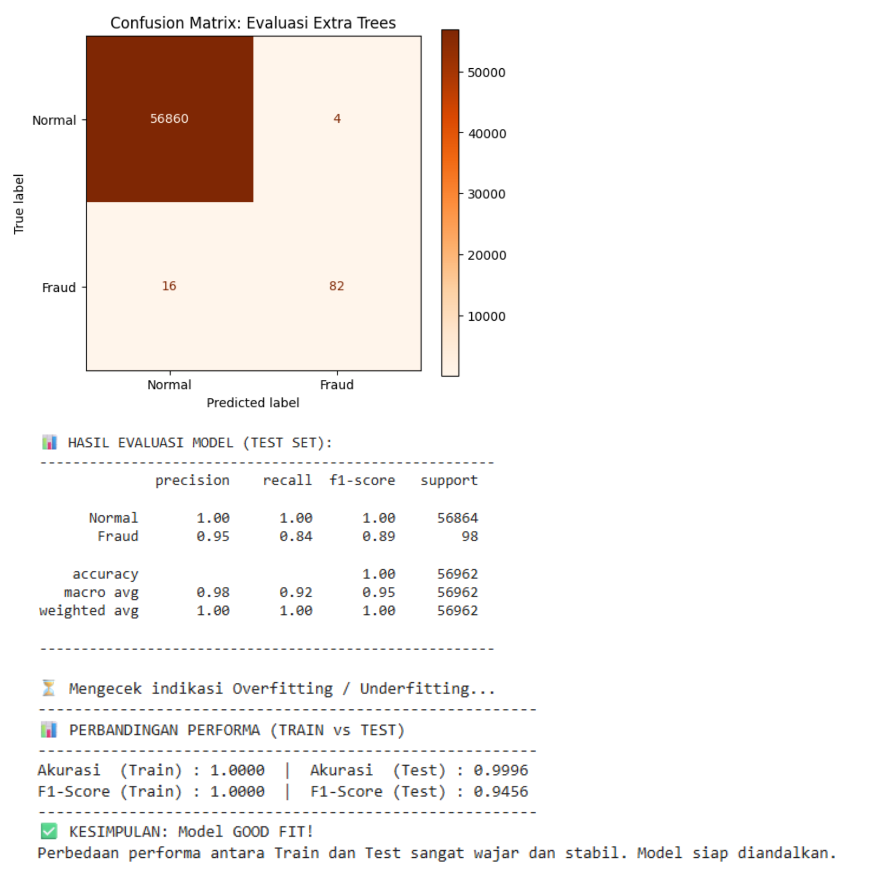

# 💳 Pancaniti ET: Credit Card Fraud Scrutiny System V1.1

  
  
  
  
  

---

## 📝 Deskripsi Proyek
***Pancaniti ET: Credit Card Fraud Scrutiny System V1.1*** merupakan iterasi stabil dari sistem deteksi penipuan kartu kredit yang mengutamakan integritas data asli. 

Berbeda dengan versi sebelumnya, V1.1 **tidak menggunakan teknik Hybrid Resampling (SMOTE + Undersampling)**. Model dilatih langsung menggunakan distribusi data asli untuk memastikan bahwa pola yang dipelajari adalah representasi murni dari transaksi nyata. Dengan menggunakan algoritma **Extra Trees Classifier**, sistem ini terbukti sangat tangguh dalam menangani ketimpangan data tanpa terjebak dalam masalah *overfitting*.

---

## 🚀 Fitur Utama
* **Original Data Training**: Melatih model pada distribusi data asli untuk menghindari distorsi dari data sintetis.
* **Good Fit Performance**: Performa stabil di mana hasil evaluasi data latih dan data uji memiliki selisih yang sangat kecil (Aman dari Overfitting).
* **Robust Feature Scaling**: Menggunakan `RobustScaler` untuk menangani fitur `Time` dan `Amount` yang memiliki *outlier* ekstrem.
* **Cloud Integration**: Model dikemas dan dideploy secara otomatis ke **Hugging Face Hub** untuk aksesibilitas yang lebih luas.

---

## 🧠 Metodologi V1.1: Stabilitas adalah Kunci
Pada versi ini, fokus dialihkan dari "menyeimbangkan jumlah data" menjadi "mengoptimalkan pembelajaran algoritma". 

1. **Efisiensi Extra Trees**: Algoritma ini secara alami sangat baik dalam melakukan generalisasi pada data yang kompleks.
2. **Eliminasi Bias**: Tanpa SMOTE, model tidak berisiko menghafal data buatan, sehingga prediksi pada data dunia nyata menjadi lebih objektif.
3. **Validasi Ketat**: Menyertakan pengecekan otomatis selisih *F1-Score* antara fase *Train* dan *Test* untuk menjamin model tidak *overfit*.

---

## 🛠️ Tech Stack
| Komponen | Teknologi |
| :--- | :--- |
| **Bahasa** |  |
| **Modeling** |  |
| **Manipulasi Data** |   |
| **Deployment** |  |

---

## 📊 Hasil Evaluasi & Stabilitas
Model V1.1 menunjukkan karakteristik **Good Fit**. Hal ini dibuktikan dengan:
- **Akurasi & F1-Score**: Nilai yang konsisten tinggi baik pada data latih maupun data uji.
- **Confusion Matrix**: Kemampuan deteksi kelas *Fraud* yang tajam dengan tingkat *False Positive* yang sangat rendah.
- **Generalisasi**: Model siap digunakan untuk data transaksi baru karena tidak "menghafal" data latihan secara berlebihan.

  

---

## 🌐 Akses Model
Model stabil versi 1.1 tersedia untuk publik di sini:
👉 **[Hugging Face Repository - V1.1](https://huggingface.co/Ripanrz/credit-card-fraud-et-v1.1)**

---
***Project dikembangkan sebagai bagian dari eksperimen sistem keamanan finansial berbasis AI yang aman dan stabil.***
